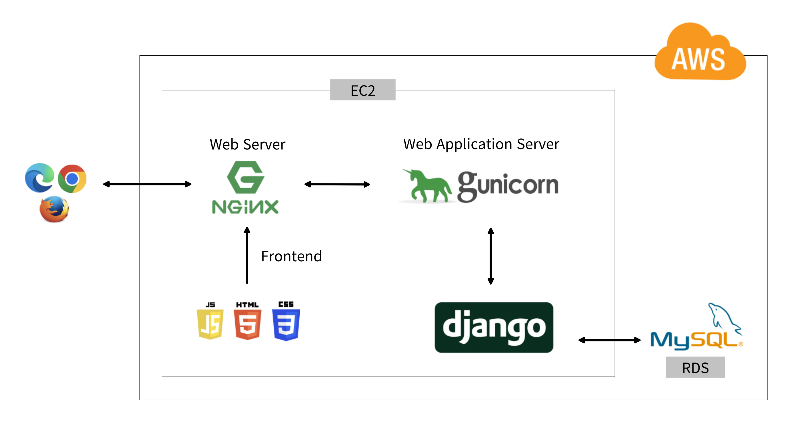
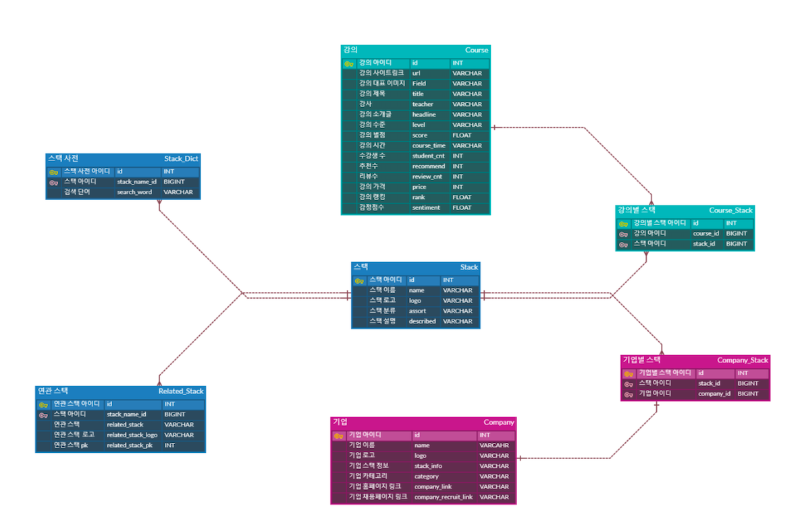
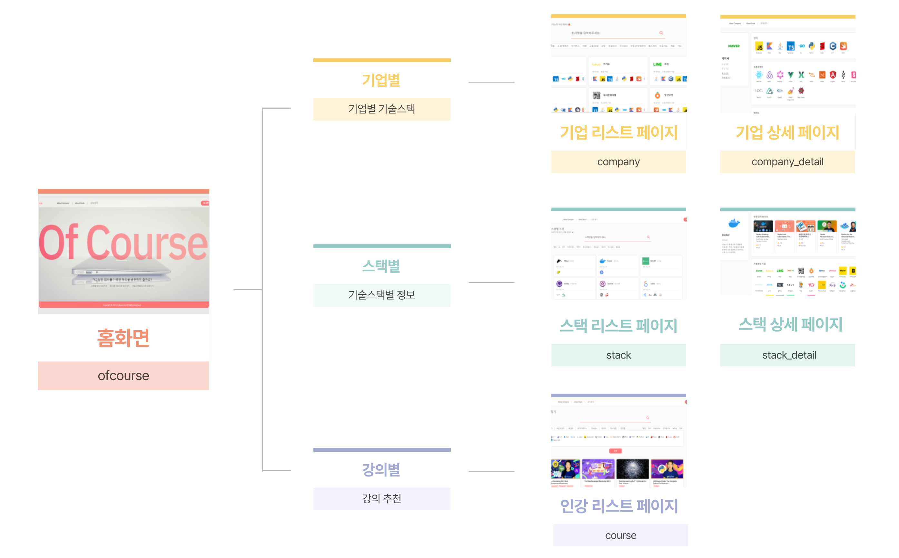

# OFCOURSE

   
  
   

## 목차

1. [**프로젝트 소개**](#1)
1. [**기술 스택**](#2)
1. [**주요 기능**](#3)
1. [**시스템 아키텍쳐**](#4)
2. [**ERD**](#5)
3. [**사이트맵**](#6)
4. [**사이트 시연영상**](#7)
5. [**개발 기간 및 일정**](#8)
6. [**본인 BE 기여도**](#9)

## 💻 프로젝트 소개

  
### 주제
  - 기업들의 사용 기술 스택 정보 제공 및 맞춤 인터넷 강의 추천 프로젝트
  
### 프로젝트 개요/동기
  - 서비스 대상 : 개발 입문자, IT기업 취준생
  - 기획 의도 및 목표 : 
     - IT기업에 취업하고자 하는 비전공자의 수가 꾸준히 증가하고 있는 현실을 반영하여, IT기업이 사용하고 있는 기술 스택들에 대한 정보를 이용자에 제공
         -  구인 기업들의 IT기술 스택별로 학습할 수 있는 정보 제공
  - 추천 알고리즘 : 개발 인터넷 강의들의 데이터를 분석하여 독자적인 추천 알고리즘 모델을 구축하여 인강을 랭킹순으로 추천하고자 함.

### 팀구성
  - FE 1명
  - BE 4명

 

## ⚒️ 기술 스택
### Frontend

| HTML | CSS |  Java Script | Bootstrap |
|------|-----|------------|-----------|
|  |  |  |  |

### Backend

| Python | Django | MySQL |  AWS RDS |
|--------|--------|-------|---------|
|  |  |  |  |

### AI

| Pandas | Matplotlib | Scikit- Learn | Seaborn | CUDA |
|--------|------------|--------------|---------|------|
|  |  |  |  |  |

### Infra

| AWS EC2 | Nginx |
|---------|-------|
|  |  |

### Tools

| Git | GitHub | Figma | VS Code | Slack | Notion |
|-----|--------|-------|---------|-------|--------|
|  |  |  |  |  |  |

 

## ⭐️ 주요기능

|    기능     |내용                                                                                                   |
| :---------------:| :---------------------------------------------------------------------------------------------|
|  기술 스택 |  현업에서 쓰이는 기술스택과 연관 기술스택을 포지션별로 볼 수 있습니다.                                 |
|  검색 기능 향상| 기술 스택 사전을 구축함으로 강의 검색 기능 향상                                                |
|  IT 회사 | 회사들이 사용하는 기술스택을 보여주며, 어떤 회사들이 있는지 볼 수 있습니다.                              
|  강의    | 기술 스택과 과련된 강의를 볼 수 있습니다.                                                        |
|    추천 알고리즘 |   여러인강사이트에서 수집한 강의들에 리뷰나 추천 수 ,별점에 대해 감정분석을 진행해 점수를 부여해 랭킹을 매겨 스택에 대한 순위별로 강의를 보여줍니다.           |

 

## ⚙️ 시스템 아키텍처

 

## 📂 ERD

 

## 🧭 사이트맵

 

## 🔗 사이트 시연 영상

### [시연영상](https://upbeat-crystal-3db.notion.site/Ofcourse-13ca2827cde280838f74f014d6e0ae52)

## 🗓️ 개발 기간 및 일정

2023.01.06 - 2023.01.31

## 👨‍💻 본인 BE 기여도
   
   - DB 설계
   - 데이터 수집 및 저장
   - 서버 배포
   - 강의 페이지 구현
  
## 기타 발표 산출물

